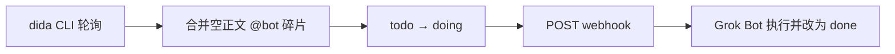

# setup-dida-bot

常驻 **Node 服务**（daemon）：把微信转发进滴答清单后被拆开的任务合并回去，用生命周期标签认领，再 webhook 唤醒 **Grok Bot** 执行。

给 **人** 和 **agent** 读。agent 按「快速开始 → 缺什么补什么」顺序做，不要跳步。

| 是 | 不是 |
|----|------|
| 跑在某台机器上的 Node 守护进程 | Grok Bot skill / 聊天食谱 |
| 通过本机 `dida` CLI 读写滴答 | 本进程内嵌滴答 OAuth / 直连 OpenAPI |
| 向 Grok Bot **webhook 例程** POST 唤醒 | 替代 Grok Bot 本身 |

推荐长期跑在 **Grok Bot 云端电脑**；也可装在任意能登录 `dida`、能访问 npm 与 webhook 的机器上。



## 需求背景

微信转发到滴答时，助手经常把**上下文 / 媒体**和结尾的 **`@bot` 指令**拆成两条（甚至多条）收件箱任务。`createdTime` 往往只差几秒到十几秒（多图聊天记录更容易偏长）。人不手动拼回去，配套机器人就看不到完整指令。

同时还要能在**已有未完成任务**上派活。状态用叶子标签：`todo`（可派发）→ `doing`（已认领）→ `done`（做完）。同一时间窗口内若有多条都像合法上下文，**不能**硬选一条合并。

本仓库只做管道：本机 `dida` CLI 轮询、合并或认领，再 webhook 叫醒 Bot。它不解读指令、不代执行、不写 `done`（由 Bot 写；也不要把任务勾成滴答「已完成」）。写回规则见 [docs/webhook.md](docs/webhook.md)；日常怎么派活见 [docs/usage.md](docs/usage.md)。

中国区用 **dida365.com**；不要换成 ticktick.com（账号不互通）。

## 当前处理方案

1. 标题含 **`@bot`**、正文为空、带 **`微信采集`** 的碎片，在窗口 **[T−15s, T+15s]**（`T` = 碎片 `createdTime`，可配置）并入同清单唯一合法上下文。
2. 窗口内 ≥2 条上下文 → `@bot` 改成 **`@not`**，打 **`freeze`**，不再自动合并。
3. 合并成功 → 叶子 **`todo`**；webhook HTTP 成功 → **`doing`**。
4. POST `event: dida_bot_work`，`source: setup-dida-bot`。Bot 执行后写 **`done`**（保留 `微信采集`；不勾完成）。

默认标记（`@bot` / `@not` / `bot` / `todo`…`freeze` / `微信采集`）均可在 `config.json` 整组改名；语义与反例见 [docs/usage.md](docs/usage.md)。

## 快速开始

人与 agent 共用。任一步失败 → 停在对应小节修好再往下。

1. Node.js **20+**（`node -v`）
2. 安装并登录 **dida CLI**（见下）
3. `git clone` → `npm install` → 复制 `config.example.json` 为 `config.json`，填 webhook
4. 理解标签约定（[docs/usage.md](docs/usage.md)）；默认会自动创建 `bot` 父子标签
5. `npm test`；`npm run once` 写出 `data/status.json` 且 `ok: true`
6. `npm run daemon` 常驻；需要时再 `npm run ui`（仅 `127.0.0.1:8788`）

### dida CLI

本服务**不捆绑** CLI，只调用 PATH（或 `didaBinary`）上的 `dida … --json`。不读 token，不直连滴答 HTTP。

- npm：[`@suibiji/dida-cli`](https://www.npmjs.com/package/@suibiji/dida-cli)
- 帮助中心：<https://help.dida365.com/articles/7464976698707017728>（勿臆造 GitHub 仓库链接）

```bash
npm install -g @suibiji/dida-cli
dida auth login
dida tag list --json
```

| 现象 | 怎么办 |
|------|--------|
| `command not found` | 安装 CLI，或把 `didaBinary` 设为绝对路径 |
| 鉴权失败 | 在**跑 daemon 的同一用户**下 `dida auth login` |
| `tag list` 非零 | 先修好 CLI；不要伪造 token 调 OpenAPI |

### Grok Bot webhook

1. 创建 webhook 例程（建议名 **setup-dida-bot webhook**）
2. URL / secret 只写入本机 `config.json`（勿提交、勿写进文档）
3. 提示词用 [docs/webhook.md](docs/webhook.md) 模板

`webhookUrl` 为空时仍会合并，但不 POST、不把叶子改成 `doing`。载荷与认证见该文档。

### 安装命令

```bash
git clone https://github.com/dulk-dev/setup-dida-bot.git
cd setup-dida-bot
npm install
cp config.example.json config.json
# 编辑 webhookUrl、webhookSecret

npm test
npm run once      # 一轮 → data/status.json
npm run daemon    # 常驻；intervalSeconds 默认 30，下限 15
npm run status
npm run ui        # http://127.0.0.1:8788/
npm run selftest  # 需已 login；建测试任务打 mock webhook 后清理
```

`daemon` 是**一个**常驻进程（醒 → 跑一轮 → 睡），不是 cron 每次另起脚本。停进程或机器重启后轮询停止。

### 开机自启与保活

Grok Bot 云端电脑重启或被换成新机器后，这个进程不会自己回来。那里通常没有 systemd / crontab。

在仓库根执行 `bash scripts/ensure-daemon.sh`（或 `npm run ensure`）。已在跑会打印 `already_running pid=…` 并退出；否则后台拉起并打印 `started pid=…`。重复执行是安全的。

可选：另建一条 Grok Bot 例程，每天跑 1～2 次这条脚本作补漏；健康时保持安静。细节见 [docs/autostart.md](docs/autostart.md)。

## 配置参考

读项目根 `config.json`，或环境变量 `SETUP_DIDA_BOT_CONFIG`。只提交 [`config.example.json`](config.example.json)。

| 字段 | 默认 | 说明 |
|------|------|------|
| `enabled` | `true` | `false` 跳过本轮 |
| `intervalSeconds` | `30` | 轮询间隔（秒），下限 15 |
| `didaBinary` | `dida` | CLI 路径 |
| `botMarker` / `notMarker` | `@bot` / `@not` | 标题标记 |
| `wechatCaptureTag` | `微信采集` | 来源标签 |
| `tagParent` / `tagTodo`…`tagFreeze` | `bot` / `todo`… | 父子标签 |
| `ensureParentTag` | `true` | 缺标签时自动创建 |
| `webhookUrl` / `webhookSecret` | `""` | 本机密钥 |
| `webhookAuthStyle` | `both` | `bearer` \| `header` \| `both` |
| `maxMergeOrNot` / `maxClaim` / `maxHydrate` | `10` / `8` / `10` | 每轮上限 |
| `dependencyWindowBeforeMs` / `AfterMs` | `15000` | 依赖窗（前后各 15 秒） |
| `uiHost` / `uiPort` | `127.0.0.1` / `8788` | 状态页只绑本机 |
| `dataDir` | `data` | 相对项目根 |

状态页只能改 `intervalSeconds` 与 `enabled`。改标记或 webhook 后须重启 daemon。

运行时文件（勿提交）：`data/merge.lock`、`data/processed.json`、`data/status.json`、`data/daemon.pid`、`data/daemon.log`。

## 文档与安全

| 文档 | 内容 |
|------|------|
| [docs/usage.md](docs/usage.md) | 日常用法、反例、标签语义 |
| [docs/webhook.md](docs/webhook.md) | 认证头、载荷、例程提示词 |
| [docs/autostart.md](docs/autostart.md) | 云端电脑上的保活与补跑 |
| [SECURITY.md](SECURITY.md) | 勿提交密钥、登录态与 status |

## 故障排查

| `data/status.json` / 日志 | 含义 | 动作 |
|---------------------------|------|------|
| `dida: command not found` 类 | CLI 未装好 | [dida CLI](#dida-cli) |
| 鉴权 / login | 未登录或失效 | `dida auth login` |
| `ok: false` + `fetch failed` | 偶发网络 | 看下一轮；持续再查网络 |
| `webhookConfigured: false` | 未配 URL | 填 `webhookUrl` |
| `skipped` + `waiting_deps` | 窗内还无唯一上下文 | 等采集到齐；若已过窗见 [usage 反例](docs/usage.md#反例) |
| 合并为 0 且有 `@bot` 空任务 | 可能缺 `微信采集` | [usage · 微信采集](docs/usage.md#微信采集) |
