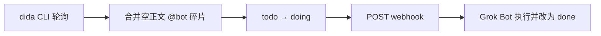

# setup-dida-bot

常驻 **Node 服务**（daemon）：把微信转发进滴答清单后被拆开的任务合并回去，用生命周期标签认领，再 webhook 唤醒 **Grok Bot** 执行。

本文档同时给 **人** 和 **agent / bot** 读。agent 应按「依赖 → 安装 → 配置 → 启动 → 自检」顺序执行；缺某一项时，先按对应小节补齐，再继续，不要跳步硬跑。

## 这是什么 / 不是什么

| 是 | 不是 |
|----|------|
| 跑在某台机器上的 Node 守护进程 | Grok Bot skill / 聊天食谱 |
| 通过本机 `dida` CLI 读写滴答 | 本进程内嵌滴答 OAuth / 直连 OpenAPI |
| 向 Grok Bot **webhook 例程** POST 唤醒 | 替代 Grok Bot 本身 |

推荐长期跑在 **Grok Bot 云端电脑**；也可以装在任意能登录 `dida`、能访问 GitHub/npm 与 webhook 的机器上。



## 需求背景

微信转发到滴答时，助手经常把**上下文 / 媒体**和结尾的 **`@bot` 指令**拆成两条（甚至多条）收件箱任务。两条的 `createdTime` 往往只差几秒到十几秒（聊天记录带多图时更容易偏长）。人不手动拼回去，配套机器人就看不到完整指令。

同时还要能在**已经存在的未完成任务**上派活，而不是只处理微信新拆出来的碎片。派发状态用三片叶子标签表达：`todo`（可派发）、`doing`（已认领）、`done`（做完）。同一时间窗口里如果有多条都像合法上下文，**不能**选一条硬合并。

本仓库提供的是管道：在本机用 `dida` CLI 轮询、合并或认领，再 webhook 叫醒 **Grok Bot**。它不读指令语义、不代为执行、也不把任务写成 `done`——`done` 由被唤醒的 Bot 写入（且不要把滴答任务勾成「已完成」）。

写回时 Bot **不得整段覆盖**转发原文；结论用正文末尾 `\n\n---\n\n` 追加，或写在评论。细则见 [docs/webhook.md](docs/webhook.md)。

## Agent 快速清单

按顺序勾选。任一项失败 → 停在该节，按「缺失时怎么办」处理后再往下。

1. [ ] Node.js **20+** 可用（`node -v`）
2. [ ] 已安装并登录 **dida CLI**（见 [依赖：dida CLI](#依赖dida-cli)）
3. [ ] 已克隆本仓库并 `npm install`
4. [ ] 已从 `config.example.json` 复制出本机 `config.json`，填好 webhook（见 [依赖：Grok Bot webhook](#依赖grok-bot-webhook)）
5. [ ] 滴答标签约定理解清楚（见 [依赖：滴答标签](#依赖滴答标签)）；默认会由 daemon 自动创建 `bot` 父子标签
6. [ ] `npm test` 通过；`npm run once` 能写出 `data/status.json` 且 `ok: true`
7. [ ] `npm run daemon` 常驻；需要时再开 `npm run ui`（仅本机 `127.0.0.1:8788`）

## 当前处理方案

行为摘要（细节与默认窗长见配置表）：


1. 找出标题含 **`@bot`**、正文为空、且带 **`微信采集`** 的碎片，在时间窗口内（默认 **[T−15s, T+15s]**，`T` 为碎片 `createdTime`）并入对应上下文任务。
2. 同一窗口命中多条上下文 → 把 `@bot` 改写成 **`@not`**，打上 **`freeze`**，不再自动合并。
3. 合并后的任务进入生命周期叶子 **`todo`**；webhook HTTP 成功后改为 **`doing`**。
4. POST `event: dida_bot_work`，`source` 固定为 `setup-dida-bot`。Bot 读任务、执行指令，再把叶子改为 **`done`**（保留 `微信采集`；**不要勾选完成**）。写回时**不得整段覆盖转发正文**；结论用 `\n\n---\n\n` 追加文尾或写在评论。细节见 [docs/webhook.md](docs/webhook.md)。

默认标记（均可在 `config.json` 整组改名，改完重启 daemon）：

| 用途 | 默认 | 说明 |
|------|------|------|
| 碎片标题标记 | `@bot` | 写在**任务标题**里，不是标签名 |
| 歧义改写 | `@not` | 同上 |
| 父标签 | `bot` | 滴答标签；叶子挂在它下面 |
| 生命周期叶子 | `todo` / `doing` / `done` | 滴答标签；同一任务只保留一个叶子 |
| 冻结 | `freeze` | 滴答标签 |
| 微信来源 | `微信采集` | 滴答标签；一般由微信→滴答采集带上 |

## 依赖：运行环境

| 依赖 | 为何需要 | 缺失时怎么办 |
|------|----------|----------------|
| Node.js 20+ | 跑本服务 | 安装 Node 20 或更高，确认 `node -v`、`npm -v` |
| Git | 克隆仓库 | 安装 git 后 `git clone https://github.com/dulk-dev/setup-dida-bot.git` |
| 出网 | npm、dida 登录、POST webhook | 检查代理/防火墙；webhook 需能访问 Cursor / Grok Bot 网关 |

所有命令都在**克隆后的项目根目录**（含 `package.json` 的那一层）执行。

## 依赖：dida CLI

本服务**不捆绑** CLI，只调用 PATH（或 `config.json` 的 `didaBinary`）上的 `dida … --json`。登录态由 CLI 自己保管；本进程**不读 token**，也不直连滴答 HTTP。

### 官方安装文档（agent 应打开阅读）

1. npm 包：[`@suibiji/dida-cli`](https://www.npmjs.com/package/@suibiji/dida-cli)  
2. 滴答帮助中心安装说明：<https://help.dida365.com/articles/7464976698707017728>

该 npm 包没有公开的 GitHub 仓库字段，**不要**臆造 `github.com/.../dida-cli` 链接。

### 安装与登录

```bash
npm install -g @suibiji/dida-cli
dida auth login
dida tag list --json    # 能出 JSON 即说明 CLI 可用
```

### 缺失 / 失败时

| 现象 | agent 动作 |
|------|------------|
| `dida: command not found` | 按上一节安装；仍找不到则把 `config.json` 的 `didaBinary` 设为可执行文件绝对路径 |
| 未登录 / 鉴权错误 | 在**跑 daemon 的同一用户**下执行 `dida auth login`，用浏览器完成授权 |
| `dida tag list` 非零退出 | 先修好 CLI，再跑本服务；不要改用伪造 token 调 OpenAPI |

中国区账号用 **dida365.com** 体系；不要改成 ticktick.com（账号不互通）。

## 依赖：滴答标签

约定结构（默认名）：

```text
bot                    ← 父标签 tagParent
├── todo               ← 待办（合并后）
├── doing              ← 已认领、等待 / 正在被 Bot 处理
├── done               ← Bot 做完后写入
└── freeze             ← 歧义碎片，不再自动合并
```

标题里的 **`@bot` / `@not`** 不是标签标签，无需在标签列表里创建同名项。

### daemon 会自动创建什么

配置 `ensureParentTag: true`（默认）时，每轮开始会调用 `ensureBotTags`：

- 若缺少父标签 `bot` → `dida tag create --name bot …`
- 若缺少 `todo` / `doing` / `done` / `freeze` → 创建为 `bot` 的子标签

因此：**agent 一般不必手建这五个标签**；跑通 `npm run once` 或 `daemon` 后，用 `dida tag list --json` 核对即可。

若将 `ensureParentTag` 设为 `false`：agent / 人必须事先建好父标签与叶子（可用滴答 App，或）：

```bash
dida tag create --name bot --label bot --json
dida tag create --name todo --label todo --parent bot --json
dida tag create --name doing --label doing --parent bot --json
dida tag create --name done --label done --parent bot --json
dida tag create --name freeze --label freeze --parent bot --json
```

### `微信采集`

合并逻辑依赖碎片带有来源标签 **`微信采集`**（可用 `wechatCaptureTag` 改名）。该标签通常由「微信 → 滴答」采集流程打上。

| 情况 | 怎么办 |
|------|--------|
| 账号里还没有这个标签 | 在滴答 App 建同名标签，或：`dida tag create --name 微信采集 --label 微信采集 --json` |
| 微信转发任务没有该标签 | 先修好采集/自动打标；否则碎片不会被当成可合并对象 |

### 改名整组标记

若要把 `@bot` / `bot` / `todo`… 改成别的名字：在 `config.json` **整组一起改**，保证父子关系一致，然后重启 daemon。改名后旧任务上的旧标签不会自动迁移，需人工或另写脚本处理。

## 依赖：Grok Bot webhook

daemon 认领前会 POST 到例程 URL。URL 与密钥**只写本机** `config.json`，禁止提交、禁止写进文档正文。

1. 在 Grok Bot 创建（或使用）webhook 例程，建议名：**setup-dida-bot webhook**。
2. 把例程给出的 URL、secret 填进本机 `config.json` 的 `webhookUrl` / `webhookSecret`。
3. 例程提示词用 [docs/webhook.md](docs/webhook.md) 里的精简模板（校验一行 + 处理 `pending` + 回写；网关说明只在文档、不进例程）。

| 情况 | 怎么办 |
|------|--------|
| 还没有 Grok Bot / webhook | 先在 Cursor / Grok Bot 侧建 bot 与 webhook 例程，再填配置 |
| `webhookUrl` 留空 | daemon 仍会合并碎片，但**不 POST、不把叶子改成 doing** |
| POST 失败 | 叶子留在 `todo`，下轮重试；查 URL、密钥、`webhookAuthStyle`（默认 `both`） |

载荷与认证头说明见 [docs/webhook.md](docs/webhook.md)。

## 安装与启动

```bash
git clone https://github.com/dulk-dev/setup-dida-bot.git
cd setup-dida-bot
npm install
cp config.example.json config.json
# 编辑 config.json：webhookUrl、webhookSecret；其余可先用默认
```

```bash
npm test          # 单元测试
npm run once      # 只跑一轮，写 data/status.json
npm run daemon    # 常驻；按 intervalSeconds 轮询（示例默认 30，代码下限 15）
npm run status    # 打印最近一次 status
npm run ui        # http://127.0.0.1:8788/ 可改 interval / enabled
```

`npm run selftest`：用已登录的 `dida` 建一对标题前缀 `[setup-dida-bot-test]` 的收件箱任务，打到本机 mock webhook 后清理。需已 `dida auth login`。

进程模型：`daemon` 是**一个常驻 Node 进程**，醒了跑一轮合并逻辑，再按间隔休眠；不是 cron 每次另起脚本。停进程或机器重启后轮询停止。

## 配置参考

默认读项目根目录 `config.json`；也可用环境变量 `SETUP_DIDA_BOT_CONFIG` 指向其他路径。仓库只提交 [`config.example.json`](config.example.json)；`config.json` 在 `.gitignore` 中。

| 字段 | 示例默认 | 说明 |
|------|----------|------|
| `enabled` | `true` | `false` 时跳过本轮 |
| `intervalSeconds` | `30` | 轮询间隔（秒），下限 15 |
| `didaBinary` | `dida` | CLI 可执行文件 |
| `botMarker` / `notMarker` | `@bot` / `@not` | 标题标记 |
| `wechatCaptureTag` | `微信采集` | 来源标签 |
| `tagParent` | `bot` | 父标签 |
| `tagTodo` / `tagDoing` / `tagDone` / `tagFreeze` | `todo`… | 生命周期与冻结叶子 |
| `ensureParentTag` | `true` | 缺父/叶子时自动 `dida tag create` |
| `webhookUrl` / `webhookSecret` | `""` | 本机密钥 |
| `webhookAuthStyle` | `both` | `bearer` \| `header` \| `both` |
| `maxMergeOrNot` / `maxClaim` / `maxHydrate` | `10` / `8` / `10` | 每轮上限 |
| `dependencyWindowBeforeMs` / `AfterMs` | `15000` | 依赖时间窗（默认前后各 15 秒） |
| `uiHost` / `uiPort` | `127.0.0.1` / `8788` | 状态页只绑本机 |
| `dataDir` | `data` | 相对项目根 |

状态页只能改 `intervalSeconds` 与 `enabled`。改标记或 webhook 后须重启 daemon。

### 数据目录

- `data/merge.lock` — 文件锁（约 120 秒过期）
- `data/processed.json` — 已处理碎片 id（约 60 天过期）
- `data/status.json` — 最近一轮结果（可能含标题，勿提交）

## 仓库结构（给 agent）

```text
setup-dida-bot/
  README.md              ← 你在这里
  SECURITY.md
  config.example.json
  package.json
  src/                   ← Node 服务源码（cli / daemon / merge / dida CLI 客户端 / ui）
  docs/webhook.md        ← webhook 载荷与例程提示词
  test/
  scripts/               ← selftest 等
  data/                  ← 运行时（gitignore 内容，勿提交密钥与 status）
```

## 安全

见 [SECURITY.md](SECURITY.md)。摘要：

- 勿提交 `config.json`、`data/status.json`、`data/processed.json`
- 勿提交 `~/.config/dida-cli/` 下的登录态
- 文档示例只用虚构任务 id

## 故障排查（agent）

| `data/status.json` / 日志 | 含义 | 动作 |
|---------------------------|------|------|
| `dida: command not found` 类 | CLI 未装好 | [依赖：dida CLI](#依赖dida-cli) |
| 鉴权 / login 相关 | 未登录或登录态失效 | `dida auth login` |
| `ok: false` + `fetch failed` | 偶发网络 | 看下一轮；持续失败再查网络 |
| `webhookConfigured: false` | 未配 URL | 填 `webhookUrl` |
| `skipped` + `waiting_deps` | 碎片还在等上下文窗 | 正常；等微信上下文到齐或过窗 |
| 合并为 0 且有 `@bot` 空任务 | 可能缺 `微信采集` | [依赖：滴答标签](#依赖滴答标签) |
