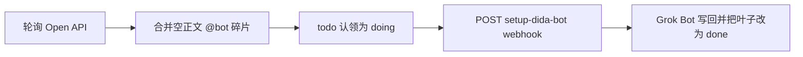

# setup-dida-bot

本地 Node 守护进程：把微信转发进滴答清单后被拆开的任务合并回去，打上生命周期标签认领，再 webhook 唤醒 Grok Bot。

## 需求背景

微信转发到滴答清单时，一条消息常被拆成多条任务：有正文的上下文，以及标题里带 `@bot`、正文为空的碎片。需要把这些空正文碎片并回上下文任务，用生命周期标签 `todo` → `doing` → `done` 认领，再 webhook 唤醒 Grok Bot。

先前这条链路跑在 Cloudflare Worker `dida-bot-merge` 上。Worker 依赖 Cloudflare 运行时，不适合作为可开源的本机产品。本仓库是正式的本地 Node daemon：轮询滴答 Open API，完成合并和认领，并向 Grok Bot 例程「setup-dida-bot webhook」发唤醒。URL 和密钥只留在本机。

## 当前方案

守护进程按间隔轮询滴答 Open API。访问令牌不写在本仓库里，而是读取本机 [dida-cli](#dida-cli) 已经登录好的 `access_token`。

每一轮大致是：



1. 找出标题含 `@bot`、正文为空、且带 `微信采集` 的碎片，在创建时间窗口内并入对应的上下文任务。同一窗口命中多条上下文时，把 `@bot` 改写成 `@not` 并打上 `freeze`，不再自动合并。
2. 合并后的任务进入 `todo`。webhook 返回成功后，叶子改为 `doing`。
3. 向「setup-dida-bot webhook」POST `event: dida_bot_work`，`source` 固定为 `setup-dida-bot`。Bot 读任务、执行标题和正文里的指令，并把叶子改为 `done`。Bot 侧步骤见 [docs/webhook.md](docs/webhook.md)。

出厂默认标记：

| 用途 | 默认 |
|------|------|
| 碎片标记 | `@bot` |
| 歧义改写 | `@not` |
| 生命周期 | `todo` / `doing` / `done` |
| 冻结 | `freeze` |
| 父标签 | `bot`（`ensureParentTag: true` 时会确保存在） |
| 微信来源 | `微信采集` |

### 和旧 Worker 的能力对照

标记与旧 Worker 相同。差异在运行时，不在标签名。

| 能力 | 线上 Worker `dida-bot-merge` | 本仓库 |
|------|------------------------------|--------|
| 并发与去重 | Cloudflare KV | 文件锁 `data/merge.lock` + 已处理集合 `data/processed.json` |
| OAuth 到期提醒 webhook | Worker 侧会发 | 还没有。`src/webhook.ts` 里有 `dida_token_expiry_reminder` 类型，daemon 目前不发送 |
| 控制面 | Worker 配置 | 本机状态页，默认只听 `http://127.0.0.1:8788/` |
| webhook `source` | Worker 自己的上游标识 | 固定 `setup-dida-bot` |
| 标记 | `@bot` / `todo` / `doing` / `done` | 同一套 |

### 迁移与双写

线上 Worker `dida-bot-merge` 若仍在跑，会和本 daemon 写同一批 `@bot` / `todo` / `doing` / `done` 任务。**该 Worker 应保持暂停。** 两边同时开就是双写。

需要第二条隔离车道时，可以在本机 `config.json` 改成 `@botx` / `@notx` / `x-bot` / `x-todo` / `x-doing` / `x-done` / `x-freeze`。这不是出厂默认。`@bot` 是 `@botx` 的前缀，两条车道不要对着同一批收件箱同时开。

## 快速开始

需要 Node.js 20+。下面的命令都在**克隆后的项目根目录**执行（含 `package.json` 的那一层）。

### dida-cli

本仓库只读 token，不捆绑 CLI。请单独安装滴答官方分发的 dida-cli，再登录。与默认 `tokenPath`（`~/.config/dida-cli/config.json` 的 `access_token`）对齐的是 npm 包 [`@suibiji/dida-cli`](https://www.npmjs.com/package/@suibiji/dida-cli)。滴答帮助中心的安装说明：<https://help.dida365.com/articles/7464976698707017728>。

该 npm 包没有公开的 GitHub 仓库字段，这里不链任何 `github.com/.../dida-cli` 地址。

```bash
npm install -g @suibiji/dida-cli
dida auth login
```

`dida auth login` 把 `access_token` 写到 `~/.config/dida-cli/config.json`。脚本加载 token 时只在日志里打印前后各 4 个字符的预览。

### 安装与跑起来

```bash
git clone https://github.com/dulk-dev/setup-dida-bot.git
cd setup-dida-bot
npm install
cp config.example.json config.json
```

编辑本机的 `config.json`，填入例程「setup-dida-bot webhook」的 `webhookUrl` 与 `webhookSecret`（只放本机，见 [安全](#安全)）。创建例程、请求头和载荷见 [docs/webhook.md](docs/webhook.md)。复制出来的 `config.json` 已经是生产标记 `@bot` / `todo` / `doing` / `done`。

```bash
npm test          # vitest，断言默认标记 @bot / todo
npm run once      # 合并 + 认领跑一轮，写入 data/status.json
npm run daemon    # 按 intervalSeconds 轮询（默认 120 秒，下限 15 秒）
npm run status    # 打印最近一次 data/status.json
npm run ui        # http://127.0.0.1:8788/ 可改 interval / enabled
```

`npm run selftest` 会用真实 Open API 建一对标题前缀为 `[setup-dida-bot-test]` 的收件箱任务，打到本机 mock webhook，然后清理。需要本机已经 `dida auth login`。

## 配置参考

默认文件是项目根目录的 `config.json`。也可以用环境变量 `SETUP_DIDA_BOT_CONFIG` 指向别的路径。仓库里只提交 [`config.example.json`](config.example.json)；`config.json` 已在 `.gitignore` 中。

| 字段 | 示例默认 | 说明 |
|------|----------|------|
| `enabled` | `true` | `false` 时 daemon 跳过本轮 |
| `intervalSeconds` | `120` | 轮询间隔（秒）。代码下限为 15 |
| `apiBase` | `https://api.dida365.com/open/v1` | 滴答 Open API 根路径 |
| `tokenPath` | `~/.config/dida-cli/config.json` | 读取其中的 `access_token` |
| `botMarker` | `@bot` | 空正文碎片的标题标记 |
| `notMarker` | `@not` | 同一窗口命中多条上下文时，把碎片标记改写成这个，并打冻结标签 |
| `wechatCaptureTag` | `微信采集` | 依赖匹配用的来源标签 |
| `tagParent` | `bot` | 生命周期叶子的父标签 |
| `tagTodo` | `todo` | 合并后的待办叶子 |
| `tagDoing` | `doing` | webhook 成功后的认领叶子 |
| `tagDone` | `done` | 由 Grok Bot 在做完后写入；daemon 自己不打完成，也不勾选任务完成 |
| `tagFreeze` | `freeze` | 歧义碎片冻结，不再自动合并 |
| `ensureParentTag` | `true` | 缺少父标签时创建 |
| `webhookUrl` | `""` | Grok Bot webhook 例程 URL。留空则只合并、不认领、不 POST |
| `webhookSecret` | `""` | 与例程密钥一致。留在本机 |
| `webhookAuthStyle` | `both` | `bearer`、`header` 或 `both`。头字段见 [docs/webhook.md](docs/webhook.md) |
| `maxMergeOrNot` | `10` | 每一轮最多合并或改写多少条碎片 |
| `maxClaim` | `8` | 每一轮最多认领多少条 |
| `maxHydrate` | `10` | 每一轮最多补拉多少条缺字段的任务 |
| `dependencyWindowBeforeMs` | `10000` | 碎片创建时间之前的依赖窗口 |
| `dependencyWindowAfterMs` | `10000` | 碎片创建时间之后的依赖窗口 |
| `uiHost` | `127.0.0.1` | 状态页只绑定本机 |
| `uiPort` | `8788` | 状态页端口 |
| `dataDir` | `data` | 相对路径相对项目根目录解析 |

状态页只能改 `intervalSeconds` 和 `enabled`。标记、webhook URL 和密钥改 `config.json` 后重启进程。

### 数据目录

- `data/merge.lock` — 文件锁。超过约 120 秒视为过期，可被下一轮拿走。
- `data/processed.json` — 已处理碎片 id，约 60 天后过期。
- `data/status.json` — 最近一轮结果，含任务标题时不要提交。

认领顺序是先 POST webhook，HTTP 成功才把 `todo` 改成 `doing`。webhook 失败时叶子留在 `todo`，下一轮可以再试。

## Webhook

创建 Grok Bot webhook 例程、三种认证头、`dida_bot_work` 载荷，以及 Bot 被唤醒后应执行的例程模板，写在 [docs/webhook.md](docs/webhook.md)。

## 安全

密钥和真实任务数据只留在本机。更短的清单见 [SECURITY.md](SECURITY.md)。

- 不要提交 `config.json`。其中的 `webhookUrl`、`webhookSecret` 只放在克隆后的本地文件里。
- 不要提交 `~/.config/dida-cli/config.json`、`data/status.json`、`data/processed.json`。
- 文档和示例只用虚构任务 id。
- 出厂标记已经是 `@bot` / `todo` / `doing` / `done`。跑本 daemon 之前，确认线上 Cloudflare Worker `dida-bot-merge` 处于暂停，避免双写。本仓库不部署、不修改该 Worker。

给代理用的安装步骤与本 README 对齐，见 [SKILL.md](SKILL.md)。
